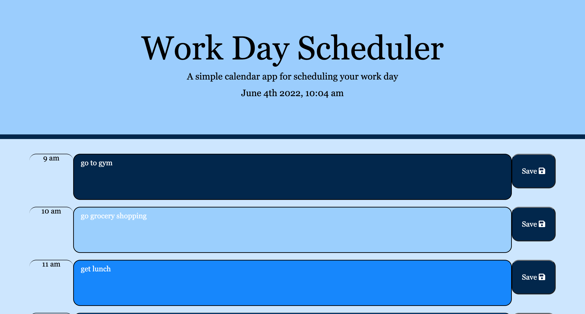

# Work Day Scheduler

## Purpose
The purpose of this project was to create a calendar application, that allowed the user set tasks divided into hour blocks of time from 9:00am-5:00pm. When the planner is opened, the current date and time are displayed at the top of the screen and each hour block is color coded depending on if the time block hour is before, after or at the current hour. The user can click the save button to save their task, and when the page is reloaded the task will still display.

## Technologies
HTML
CSS
Boostrap
JavaScript
jQuery
Moment.js

## Webpage Display

## Website Link
https://kaysie04.github.io/Code-Quiz/

## Licenses
MIT
